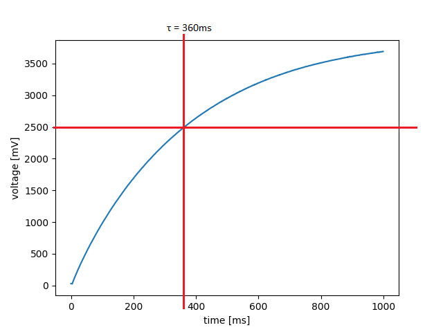
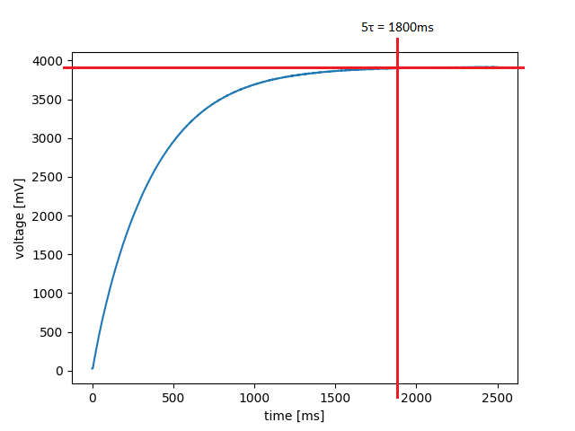
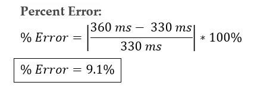

# Lab 4

Our closed loop controller moves the motor to a desired position that is defined through user input by utilizing
proportional gain values and error signals. Our step response test system prompts the user to input a proportional
gain value, K_p, then it inputs a value for the setpoint that represents one rotation, 16384. Commented code is in
the plot file to add a prompt for the user to input a setpoint value. One consideration when using the step
response test is that on reset the plot may appear empty, run the test again and the it will work properly.

Lab 3 adds three important files including: cotask.py, print_task.py, and task_share.py. The cotask file implements
a multitasking system to cooperatively run scheduled tasks. The task_share file allows the sharing of data across
files and avoids data corruption. The print_task file adds strings to a queue and prints them without blocking
other tasks. The implementation of tasks and the multitasking system allowed for the control of two motors 
simultaneously. Before the two motors were run the motor attached to a flywheel was tested to see how period
affected the response. Period being a new parameter used in the task manager.

The hand calculations below show how the time constant was found.

The figure below shows the hand calculations for the theoretical time constant.

**Figure 1. Time Constant Hand Calculations.**

The plot above shows that using the theoretical values of the resistor and capacitor that we used. 

The figure below shows the step response of the system over a 1000ms period. The point of interest was found by
finding 63% of the theoretical steady state voltage of 4000mV.

**Figure 2. Plot of voltage[mV] vs. time[ms]; Step response over 1000ms.**

As seen in the plot above, time constant is about 360ms. The figure does not show the actual steady state value,
so another step response test was ran using a longer overall time.

The figure below shows the step response over 2500ms and measures 5 time constants by finding the time where 
the voltage is about 98% of 4000mV.

**Figure 3. Plot of voltage[mV] vs. time[ms]; Step response over 2500ms.**

The plot above shows that 5 time constants is approximately 1800ms. 

The figure below shows our quick calculation to find time constant from the plot.

**Figure 4. Hand Calculations for Time Constant from Plot.**

Figure 4 shows that the time constant is the same regardless of the method used to find it.

The figure below shows the percent error of the caculations compared to the theoretical value.

**Figure 5. Percent Error Hand Calculations.**

Figure 5 shows that the percent error of the time constant is less approximately 9%.

To conclude, we learned that increasing the period past 20 makes the response undesirable. With the data that
we found a good period is between 10ms and 15ms. This is where the time to steady-state, oscillation, and
smoothness of the plot is good.